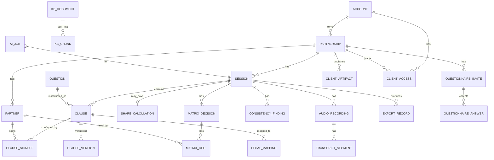
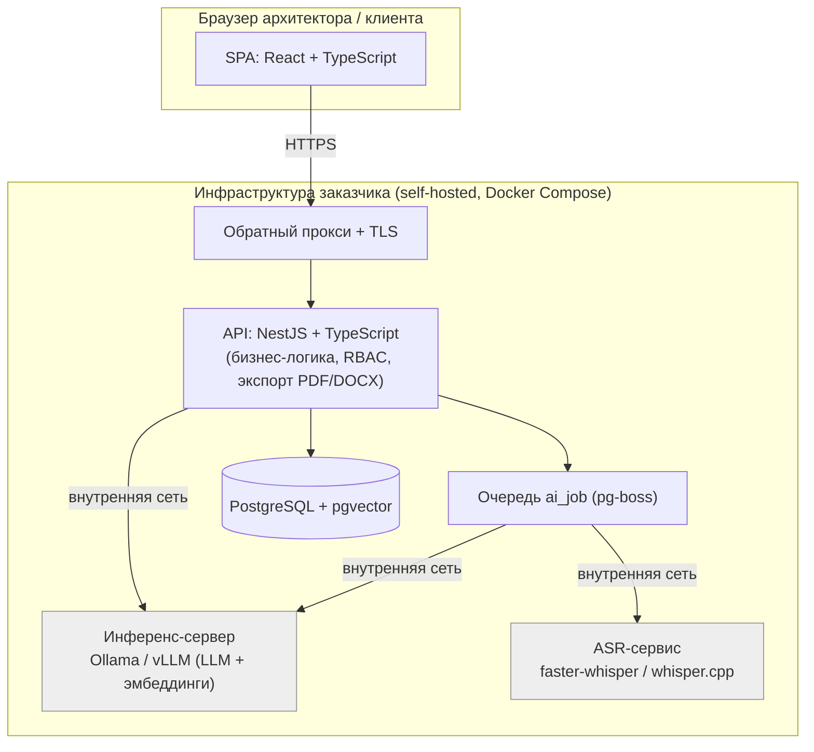

# Техническое задание: «Помощник партнёрских сессий» (MVP)

**Рабочее название продукта:** «Помощник партнёрских сессий» (далее — «Приложение», «ПС-Помощник»).
**Кодовое имя репозитория:** `partner-session-assistant` (`psa`).
**Версия документа:** 1.2 (MVP). Изменения относительно 1.1: **кабинет клиента переведён в ядро MVP** и расширен хранением постсессионных артефактов (соглашение, чек-лист легализации и др. доступны партнёру в его кабинете); добавлен **профиль dev/test для слабого сервера** (8 ГБ RAM, без GPU) с малыми моделями; **MVP зафиксирован как зависимый от интернета** (офлайн-устойчивость — после релиза); недостающий контент методики (30 вопросов, 4 принципа, строки матрицы, тестовые параметры калькулятора, предсессионный опросник) **сгенерирован как черновик** в Приложениях F–J и подлежит уточнению с Дмитрием Грицем. Ранее (в 1.1): продукт — веб-приложение (self-hosted); калькулятор Грица — часть продукта; AI — самостоятельно размещаемая модель (без сторонних облаков/OpenRouter), GPU допускается; строгий MFA/FIDO2 — в релизе.
**Назначение документа:** постановка задачи для команды разработки / кодинг-агентов. Документ самодостаточен: содержит функциональные и нефункциональные требования, модель данных, технический стек, архитектуру AI, порядок реализации, критерии приёмки, сид-данные (полный перечень 30 вопросов методики) и алгоритм калькулятора долей.

> Методика «Партнёрская сессия» — авторская технология Дмитрия Грица. Приложение реализуется с его разрешения как инструмент для команды сертифицированных архитекторов и для самого Дмитрия. Все проприетарные тексты методики, шаблоны и корпус знаний предоставляются заказчиком; в этом документе они описаны структурно.

---

## 1. Обзор и цели продукта

### 1.1. Проблема
Партнёрская сессия — структурированный разговор совладельцев длительностью 6–10 часов. Архитектор одновременно ведёт две несовместимые по нагрузке роли: **живого фасилитатора** (удерживает рамку, гасит напряжение, выносит неудобные вопросы) и **процессного движка** (проходит все ~30 блоков, ничего не пропускает, фиксирует каждую договорённость с подтверждением партнёров, ловит противоречия, раскладывает результат по юридическим носителям, назначает актуализацию). Человек не способен много часов держать обе роли на максимуме. Приложение снимает с архитектора вторую роль.

### 1.2. Тип продукта и режим работы
**Самостоятельно размещаемое веб-приложение (self-hosted).** Разворачивается на собственном сервере/инфраструктуре заказчика. Все компоненты, включая AI-инференс, работают на этой инфраструктуре; сторонние облачные сервисы не используются (требование коммерческой тайны).

**Основной режим сессии — «живой/офлайн».** Сессии часто проводятся очно: партнёры разговаривают, а архитектор слушает и заносит договорённости в формы продукта. Поэтому продукт спроектирован прежде всего как инструмент архитектора реального времени; присутствие партнёров за компьютерами не требуется.

**Опциональный режим — предсессионный опросник** через кабинет клиента: если архитектор хочет, он может заранее дать партнёрам заполнить анкету онлайн. Этот режим необязателен и не блокирует основной поток.

### 1.3. Цель MVP
Дать архитектору надёжного помощника, который ведёт сессию строго по методике (не даёт пропустить или забыть ни один блок), на лету фиксирует договорённости и подтверждения, рассчитывает доли по «Калькулятору Грица», проверяет полноту и непротиворечивость, автоматически собирает партнёрское соглашение и раскладку по юридическим документам, поддерживает жизненный цикл (версии, актуализация) и опционально собирает позиции партнёров заранее — **полностью на инфраструктуре заказчика**.

### 1.4. Принципы продукта
- **Методика первична, AI вспомогателен.** Бо́льшая часть ценности — детерминированная логика. AI подсказывает, черновит и подсвечивает; решения подтверждает архитектор.
- **Конфиденциальность.** Данные о конфликтах и долях — коммерческая тайна. Инференс, расшифровки, данные — только на инфраструктуре заказчика. Никаких сторонних облаков/агрегаторов (OpenRouter и т.п.), где неясна судьба логов.
- **Никогда не терять зафиксированное.** Автосохранение, история версий, бэкапы.
- **Деградация без AI.** При недоступной AI-среде ядро полностью работоспособно.

---

## 2. Пользователи и роли

| Роль | Кто | Доступ |
|---|---|---|
| **Архитектор** | Сертифицированный архитектор бизнес-партнёрств; сам Дмитрий Гриц | Создаёт и ведёт свои партнёрства и сессии; всё ядро продукта |
| **Администратор** | Технический/управляющий админ деплоя | Управление пользователями, настройки экземпляра, доступ к AI-настройкам |
| **Клиент (партнёр)** — опционально | Совладелец, приглашённый архитектором | Только свой предсессионный опросник по конкретному партнёрству (ограниченный кабинет) |

Изоляция данных: архитектор видит только свои партнёрства. Клиент видит только то партнёрство и тот опросник, на который его пригласили. Администратор может управлять пользователями экземпляра.

> Семейные сессии и полноценный B2C — последующие фазы продукта, не MVP.

---

## 3. Объём MVP

### 3.1. Входит в MVP
1. Аккаунты и доступ (роли архитектор/админ/клиент; простая аутентификация — см. §9).
2. Управление партнёрствами (кейсами) и сессиями.
3. Движок сценария сессии: 30 блоков с категориями, статусами, флагами «тяжёлый вопрос», логикой «неактуально».
4. Фиксация договорённостей (живой протокол) с подтверждением партнёров и историей версий.
5. **Калькулятор Грица** (расчёт долей по трём капиталам) внутри блока долей.
6. Конструктор матрицы полномочий и информирования (уровни I–V).
7. Проверка полноты и непротиворечивости (детерминированные правила + AI-подсветка).
8. Автосборка партнёрского соглашения и его экспорт (PDF/DOCX).
9. Раскладка по юридическим носителям (чек-лист легализации) и её экспорт.
10. Жизненный цикл: версии, сравнение редакций, напоминание об актуализации.
11. AI-ассистент: черновик формулировки из заметок/расшифровки, нейтральная переформулировка, подсветка пробелов/противоречий, поиск по базе знаний (RAG).
    - 11b. Распознавание речи (ASR) — в составе MVP, реализуется последним; при дефиците сроков может быть отложено без потери ценности ядра.
12. **Кабинет клиента (в ядре MVP):** предсессионный опросник со сводкой расхождений позиций для архитектора **и** хранение/доступ к постсессионным артефактам (партнёрское соглашение, чек-лист легализации и др.) для партнёров.

### 3.2. НЕ входит в MVP (явные границы)
- **Десктоп-приложение** — нет; продукт веб.
- **Сторонние облачные LLM / агрегаторы (OpenRouter и т.п.)** — нет; только self-hosted инференс на инфраструктуре заказчика.
- **Строгая MFA / FIDO2** — не в MVP (планируется в релизе); MVP — простая аутентификация (см. §9).
- **Интеграция с ЭП/нотариусом/«Центром хранения соглашений»** — нет; депонирование = ручной экспорт.
- **Семейные сессии, полноценный B2C-режим** — нет (последующие фазы).
- **Импорт контента подкаста/YouTube в базу знаний** — нет; корпус MVP = методика + заметки архитектора.
- **Офлайн-работа без связи с сервером на площадке** — нет. **MVP зависит от интернета**: во время сессии браузеру архитектора нужен доступ к серверу. Офлайн-устойчивость (PWA-кеш/синхронизация или локальное развёртывание) рассматривается после релиза.

---

## 4. Функциональные требования

Идентификаторы `FR-x.y` использовать в трекере и в критериях приёмки.

### 4.1. Аккаунты и доступ
- `FR-1.1` Регистрация/вход архитектора и админа: e-mail + пароль (см. §9 о безопасности).
- `FR-1.2` Роли и права (RBAC): архитектор, администратор, клиент. Маршруты и API защищены по роли.
- `FR-1.3` Изоляция данных: архитектор имеет доступ только к собственным партнёрствам и сессиям.
- `FR-1.4` Приглашение клиента (для опросника): архитектор генерирует приглашение по e-mail/защищённой ссылке на конкретное партнёрство; клиент получает доступ только к своему опроснику (см. §4.11).
- `FR-1.5` Управление пользователями (админ): создание/блокировка учётных записей архитекторов.

### 4.2. Партнёрства и сессии
- `FR-2.1` Список партнёрств с поиском по названию и фильтром по статусу (активные/архив).
- `FR-2.2` Создание партнёрства: название; теги типа (множественный выбор: новое, действующее, с инвестором, опционы сотрудникам, коллаборация, другое); заметки.
- `FR-2.3` Участники: 2–4 партнёра; ФИО, роль, контакт (опц.), порядок; добавление/удаление/переупорядочивание.
- `FR-2.4` Сессии внутри партнёрства: тип «первичная» или «актуализация»; для «актуализации» обязателен источник (baseline-сессия).
- `FR-2.5` Статусы сессии: черновик / в работе / завершена. Переход в «завершена» — с предупреждением при незакрытых тяжёлых блоках, незаполненной матрице или незавершённом расчёте долей.
- `FR-2.6` Архивирование партнёрства (мягкое). Безвозвратное удаление — отдельным защищённым действием с подтверждением.

### 4.3. Сценарий сессии
**Ядро «не дать забыть / не дать пропустить».**
- `FR-3.1` При создании первичной сессии инстанцируются 30 блоков из текущей версии набора вопросов (Приложение A), в фиксированном порядке методики.
- `FR-3.2` Навигация: линейный проход «вперёд/назад» и свободный переход к любому блоку через оглавление с индикаторами статуса.
- `FR-3.3` Блок отображает: номер, заголовок, основной вопрос, вспомогательные под-вопросы, бейдж категории (контур), бейдж «тяжёлый вопрос» при наличии.
- `FR-3.4` Статусы блока: `не начат` / `в работе` / `отложен` / `согласовано` / `спор` / `неактуально`. `согласовано` доступно только при наличии текста договорённости.
- `FR-3.5` Глобальный прогресс: «согласовано N из M»; отдельные счётчики незакрытых тяжёлых блоков и блоков «спор/отложен».
- `FR-3.6` **Логика «неактуально»:** перевод блока в этот статус требует подтверждающего диалога с предупреждением методики (защитный механизм избегания) и обязательной причины. Блоки никогда не скрываются — все 30 всегда в оглавлении.

### 4.4. Фиксация договорённостей (живой протокол)
**Ядро «собрать и снять рутину».**
- `FR-4.1` По каждому блоку — поле формулировки (форматируемый текст); автосохранение (debounce ≤ 2 с).
- `FR-4.2` Поле «мотивация/пояснение» (методика разрешает фиксировать логику договорённости для её толкования).
- `FR-4.3` Подтверждение партнёров: переключатель «согласен» по каждому партнёру с отметкой времени; блок полностью подтверждён, когда согласны все.
- `FR-4.4` История версий формулировки (`clause_version`): каждое значимое изменение фиксируется с временем и опц. заметкой; просмотр и откат.
- `FR-4.5` Источник текста: `вручную` / `черновик AI` / `AI + правка` (для аудита).

### 4.5. Калькулятор Грица (расчёт долей)
**Часть метода, встроена в блок долей (вопрос № 5/№ 6). Подробный алгоритм — Приложение E.**

- `FR-5.1` В блоке долей — два режима: **«Рассчитать доли (Калькулятор Грица)»** и **«Ввести итоговые доли вручную»**.
- `FR-5.2` **Применимость:** калькулятор наиболее уместен при определении долей с нуля. Для партнёрства с тегом «новое» режим калькулятора предлагается по умолчанию. Для тега «действующее» по умолчанию — ручной ввод текущих долей, но калькулятор доступен по требованию (например, при входе нового партнёра или перераспределении). Жёсткого ограничения нет — архитектор выбирает режим сам.
- `FR-5.3` Калькулятор реализует все шаги методики (Приложение E): оценка значимости трёх капиталов (экономический/человеческий/социальный) каждым партнёром → усреднение в веса W; согласование вклада экономического капитала (сумма, срок, вклад каждого) → доли E; сравнение человеческого капитала → доли H; сравнение социального капитала → доли S; расчёт по формуле `доля = E×WE + H×WH + S×WS`; контроль суммы итогов = 100%.
- `FR-5.4` Поддержка 2–4 партнёров: сетки оценок масштабируются по числу партнёров.
- `FR-5.5` Живой пересчёт при изменении любого ввода; визуализация промежуточных значений (веса, доли по капиталам, итог).
- `FR-5.6` Подсветка существенного расхождения оценок значимости капиталов между партнёрами (порог, например, > 20 п.п.) с методической подсказкой обсудить разногласие.
- `FR-5.7` Результат калькулятора записывается в блок долей как итоговые доли (`structured_data`); входные данные расчёта сохраняются (`share_calculation`) для прозрачности и версионирования; расчёт можно открыть и пересчитать заново.
- `FR-5.8` Дополнительно в блоке № 6 фиксируется **смысл долей** (голосование / прибыль / владение / убытки) как структурированные заметки; матрица голосования по отдельным вопросам выносится в корпоративный договор на этапе легализации.

### 4.6. Матрица полномочий и информирования
Авторский инструмент (вопросы № 14–16).
- `FR-6.1` Матрица: строки — типы решений, столбцы — партнёры, ячейка — уровень I–V (одиночный выбор или пусто).
- `FR-6.2` Справочник уровней (фиксирован): **I.** финальное решение единолично; **II.** блокирующее согласие; **III.** обязательное обсуждение; **IV.** информирование до реализации; **V.** информирование по факту.
- `FR-6.3` Строки: предзаполненные типовые решения (сид) + произвольные строки + переупорядочивание/удаление.
- `FR-6.4` Памятка по умолчанию (нередактируемая): «по решениям, не указанным в матрице, финальное решение принимает партнёр, в чьей зоне ответственности находится вопрос».
- `FR-6.5` Матрица включается в итоговое соглашение и в проверку полноты (пустые/конфликтные строки подсвечиваются).

### 4.7. Проверка полноты и непротиворечивости
Панель «Проверка» доступна всегда и обязательна при попытке завершить сессию.
- `FR-7.1` **Детерминированные правила (без AI):** незакрытые блоки; тяжёлые блоки в `отложен`/`спор`; блоки `согласовано` без подтверждения всех партнёров; итог долей ≠ 100%; незавершённый расчёт калькулятора (если выбран режим калькулятора); незаполненные строки матрицы; отсутствие назначенной даты актуализации.
- `FR-7.2` **AI-подсветка (при доступном AI):** анализ согласованных формулировок на противоречия между блоками (например, доли и покрытие убытков не согласуются; пересечение зон ответственности). Результат — список находок (тип, ссылки на блоки, описание, серьёзность). См. §6.4.
- `FR-7.3` Статусы находки: `открыта` / `отклонена` / `решена`; источник (`правило` / `AI`).
- `FR-7.4` Завершение сессии при открытых критичных находках — только после явного подтверждения архитектора.

### 4.8. Сборка соглашения и легализация
**Ядро «агрегировать и снять рутину».**
- `FR-8.1` Автосборка соглашения: разделы по 30 блокам в порядке методики (заголовок + формулировка + «мотивация» при наличии); включает таблицу долей (и, опц., краткую сводку расчёта), матрицу полномочий; в шапке — участники, дата, версия, статус подтверждений.
- `FR-8.2` Вводный раздел «Принципы партнёрского соглашения» (4 принципа методики, текст из сид-данных).
- `FR-8.3` Раскладка по носителям: для каждого блока/пункта — выбор одного/нескольких носителей (Приложение B) со статусом (`ожидает`/`выполнено`/`неприменимо`) и заметкой; часть сопоставлений предзаполнена по умолчанию и редактируема.
- `FR-8.4` Чек-лист легализации — отдельный документ/таблица: пункт → носитель(и) → статус → заметка.
- `FR-8.5` Экспорт: соглашение — PDF и DOCX; чек-лист — PDF, DOCX, CSV. Генерация на сервере; файл отдаётся в браузер; факт экспорта логируется (`export_record`). Оформление — §10.

### 4.9. Жизненный цикл и актуализация
- `FR-9.1` При завершении первичной сессии — обязательный шаг: назначить дату/период следующей актуализации (методика рекомендует раз в год; подсказать «лето» или «новогодние праздники»).
- `FR-9.2` Напоминание: при входе после наступления даты — список партнёрств, требующих пересмотра (и/или e-mail-уведомление, опц.).
- `FR-9.3` Сессия «актуализация»: копирует согласованные формулировки, доли и матрицу из baseline как стартовую точку; правки сбрасывают затронутые блоки в `в работе`.
- `FR-9.4` Сравнение редакций: визуальный diff формулировок, долей и матрицы между двумя сессиями партнёрства.

### 4.10. AI-ассистент
Сводно (архитектура — §6).
- `FR-10.1` **Черновик формулировки** из выделенного фрагмента заметок/расшифровки; архитектор принимает/правит/отклоняет; автосохранения нет.
- `FR-10.2` **Нейтральная переформулировка** текущего текста (нейтральный/юридический стиль).
- `FR-10.3` **Подсветка пробелов/противоречий** — §4.7/§6.4.
- `FR-10.4` **Поиск по базе знаний (RAG)** по корпусу методики и заметкам архитектора с выдачей фрагментов-источников. §6.5.
- `FR-10.5` Все AI-функции — асинхронные (очередь задач, прогресс), не блокируют UI, доступны как опция; глобальный переключатель «AI вкл/выкл»; при недоступной среде — скрыты/задизейблены.
- `FR-10.6` **ASR (модуль 11b):** запись аудио в браузере или загрузка файла → расшифровка на сервере с таймкодами → выбор сегмента → «Сформулировать пункт» (`FR-10.1`). Аудио/расшифровки хранятся на инфраструктуре заказчика (§9).

### 4.11. Кабинет клиента (предсессионный опросник и постсессионные артефакты)
Кабинет клиента входит в ядро MVP и выполняет две функции: до сессии — приватный опросник партнёра; после сессии — доступ партнёра к итоговым артефактам своего партнёрства.
- `FR-11.1` Доступ клиента: по приглашению архитектора клиент получает лёгкую учётную запись (устанавливает пароль по защищённой ссылке-приглашению), чтобы возвращаться в кабинет за артефактами. Клиент видит только своё партнёрство.
- `FR-11.2` Предсессионный опросник: архитектор формирует опросник для партнёрства (черновой набор — Приложение J, либо свой набор) и приглашает каждого партнёра.
- `FR-11.3` Клиент приватно отвечает на свои вопросы; ответы видит только архитектор (не другие партнёры).
- `FR-11.4` Архитектору доступна **сводка расхождений**: где позиции партнёров совпадают, где различаются (на основе ответов опросника), — до и во время сессии.
- `FR-11.5` Постсессионные артефакты: архитектор публикует в кабинет партнёрства итоговые документы (партнёрское соглашение, чек-лист легализации, иные файлы); каждый партнёр видит и скачивает артефакты своего партнёрства. Видимость артефакта управляется архитектором (всем партнёрам / конкретному).
- `FR-11.6` Артефакты и ответы хранятся на инфраструктуре заказчика (§9). Опросник опционален в использовании (архитектор может его не задействовать), но сам кабинет и хранение артефактов — часть ядра MVP.

---

## 5. Модель данных

СУБД — **PostgreSQL** (+ расширение **pgvector** для RAG). Ниже — основные сущности и ключевые поля; полную DDL/миграции реализует команда (ORM — §7). Все таблицы: `id` (UUID PK), `created_at`, `updated_at` где уместно.

### 5.1. ER-диаграмма (ядро)



### 5.2. Описание сущностей
- **account** — пользователь. Поля: `email`, `password_hash`, `role` (admin|architect|client), `status` (active|blocked), `display_name`.
- **partnership** — кейс. Поля: `owner_account_id`, `name`, `type_tags` (jsonb[]), `status` (active|archived), `notes`.
- **partner** — участник. Поля: `partnership_id`, `full_name`, `role`, `contact`, `order_index`.
- **session** — рабочая сессия. Поля: `partnership_id`, `kind` (initial|review), `title`, `status` (draft|in_progress|completed), `baseline_session_id` (nullable), `started_at`, `completed_at`, `next_review_at` (nullable).
- **question** — шаблонный блок. Поля: `number`, `title`, `prompt`, `helper_questions` (jsonb[]), `category`, `is_sensitive` (bool), `applies_to` (jsonb, nullable=всегда), `order_index`, `question_set_version`.
- **clause** — договорённость по блоку. Поля: `session_id`, `question_id`, `status` (not_started|in_progress|parked|agreed|disputed|not_applicable), `text`, `rationale`, `na_reason`, `source` (manual|ai_draft|ai_edited), `structured_data` (jsonb — для блока долей: итоговые доли и смысл долей).
- **clause_signoff** — подтверждение. Поля: `clause_id`, `partner_id`, `agreed` (bool), `signed_at`.
- **clause_version** — история. Поля: `clause_id`, `text`, `rationale`, `status`, `edited_at`, `note`.
- **share_calculation** — расчёт долей (калькулятор). Поля: `session_id`, `weights` (jsonb — оценки значимости капиталов по партнёрам и усреднённые W), `economic` (jsonb — сумма, срок, вклады и доли E), `human` (jsonb — оценки и доли H), `social` (jsonb — оценки и доли S), `result` (jsonb — итоговые доли по партнёрам), `is_finalized` (bool).
- **matrix_decision / matrix_cell** — строки и ячейки матрицы. `matrix_cell.level` ∈ 1..5|null.
- **legal_mapping** — пункт → носитель. Поля: `clause_id`, `carrier` (enum, Приложение B), `status` (pending|done|na), `note`.
- **consistency_finding** — находка. Поля: `session_id`, `type` (gap|contradiction|missing_signoff|parked_heavy|empty_cell|shares_sum|calc_incomplete|no_review_date), `related_refs` (jsonb), `description`, `severity` (info|warning|critical), `status` (open|dismissed|resolved), `source` (rule|ai).
- **questionnaire_invite** — приглашение клиента. Поля: `partnership_id`, `partner_id`, `account_id` (nullable, если клиент логинится), `token`, `status` (sent|opened|submitted), `question_ids` (jsonb).
- **questionnaire_answer** — ответ клиента. Поля: `invite_id`, `question_id`, `text`, `submitted_at`.
- **client_access** — доступ клиентской учётной записи к партнёрству. Поля: `account_id`, `partnership_id`, `partner_id` (nullable), `granted_at`.
- **client_artifact** — опубликованный для партнёров артефакт партнёрства. Поля: `partnership_id`, `kind` (agreement|legalization|other), `title`, `file_path`, `visibility` (all|specific), `visible_partner_ids` (jsonb, при specific), `published_by` (account_id), `published_at`.
- **audio_recording / transcript_segment** — аудио и расшифровки.
- **kb_document / kb_chunk** — база знаний; `kb_chunk.embedding` — `vector` (pgvector).
- **ai_job** — фоновая задача. Поля: `type` (transcribe|draft|rephrase|consistency|embed|search), `status` (queued|running|done|error), `input_ref` (jsonb), `output` (jsonb/text), `error`, `finished_at`.
- **export_record** — факт экспорта. Поля: `session_id`, `kind` (agreement|legalization), `format`, `file_path`, `created_at`.
- **settings** — настройки экземпляра: `locale`, `ai_enabled`, `inference_base_url`, `llm_model`, `asr_model`, `embed_model`.

---

## 6. Архитектура AI (self-hosted)

### 6.1. Базовые ограничения
- **Только инфраструктура заказчика.** AI-инференс (LLM, эмбеддинги, ASR) работает на собственном сервере/в собственной сети заказчика. **Сторонние облачные LLM и агрегаторы (OpenRouter и т.п.) запрещены** — неприемлемо из-за неопределённости с логами. Данные не покидают инфраструктуру заказчика.
- **GPU допускается.** Поскольку модель размещается на сервере заказчика (а не на ноутбуке архитектора), допускается использование GPU и более сильной модели. Конкретное железо — на усмотрение заказчика; продукт должен корректно работать как на GPU-, так и на CPU-сервере (модель конфигурируется).
- **AI опционален и асинхронен.** При недоступной AI-среде ядро работает. Тяжёлые операции — в фоновой очереди, с прогрессом, не блокируют UI.

### 6.2. Компоненты
- **Инференс-сервер:** Ollama (просто, CPU/GPU) **или** vLLM (для GPU-сервера, выше пропускная способность) — на инфраструктуре заказчика, OpenAI-совместимый эндпоинт. Backend обращается к нему по внутренней сети/`localhost`. Базовый URL и модель — в настройках (`inference_base_url`, `llm_model`).
- **LLM-модель (конфигурируема):**
  - GPU-сервер: рекомендуется `qwen2.5-14b-instruct` или `qwen2.5-32b-instruct` (сильный русский, лицензия Apache 2.0, коммерческое использование разрешено).
  - CPU-сервер: `qwen2.5-7b-instruct` (Q4_K_M) как разумный минимум; фолбэк `qwen2.5-3b-instruct`.
- **Эмбеддинги (RAG):** `bge-m3` (мультиязычная, сильный русский) или `multilingual-e5`; хранение векторов — pgvector.
- **ASR:** `faster-whisper` (GPU/CPU) или whisper.cpp, модель `whisper-medium`/`large-v3` (по доступному железу), режим `ru` — на инфраструктуре заказчика.

### 6.3. Модель выполнения (job queue)
- AI-операции оформляются как `ai_job` и исполняются фоновым воркером (вне HTTP-цикла запроса).
- Очередь: `pg-boss` (на PostgreSQL, без дополнительного брокера) — предпочтительно для лёгкости инфраструктуры; альтернатива — BullMQ + Redis.
- UI отображает статус задачи (в очереди/выполняется/готово/ошибка) и не блокируется.
- Health-check инференс-сервера при старте и перед задачами; при недоступности — понятная ошибка с подсказкой (адрес/модель), без падения приложения.

### 6.4. Промпты (шаблоны; версионируются в коде)
Общий системный промпт задаёт рамку: ассистент архитектора партнёрских сессий; **не выдумывает договорённости**, работает только с предоставленным текстом; формулирует нейтрально и по-деловому; не даёт юридических заключений; возвращает строго запрошенный формат (JSON без markdown-обёрток). Все JSON-ответы валидируются; при невалидном — повтор с ужесточением, после N попыток — пометка задачи ошибкой.
- **`draft`** — вход: контекст блока + сырой фрагмент; выход: `{"draft_text":"...","uncertainties":["..."]}`.
- **`rephrase`** — вход: текст + стиль (`neutral`|`legal`); выход: `{"rephrased_text":"..."}`.
- **`consistency`** — вход: согласованные формулировки с номерами блоков + доли/матрица текстом; выход: `[{"type":"contradiction|gap","block_refs":[5,9],"description":"...","severity":"info|warning|critical"}]`.

### 6.5. RAG
- Корпус MVP: тексты методики (пояснения к 30 вопросам, принципы) + заметки архитектора (`kb_document`).
- Индексация: чанкинг → эмбеддинги (bge-m3) → `kb_chunk` (pgvector).
- Запрос: эмбеддинг запроса → топ-k ближайших чанков → выдача фрагментов со ссылкой на источник; генеративный ответ — только на основе найденного, без «достраивания».

### 6.6. Безопасность AI-слоя
- Никаких внешних сетевых вызовов; только инференс-сервер заказчика.
- Аудио, расшифровки, эмбеддинги, тексты договорённостей не покидают инфраструктуру заказчика.
- AI-выводы всегда подтверждаются архитектором перед сохранением.

### 6.7. Профиль dev/test (слабый сервер: 8 ГБ RAM, без GPU)
Для первичной разработки и интеграционного тестирования целевой сервер — **8 ГБ RAM, без GPU**, где PostgreSQL, API и инференс работают на одной машине. На таком железе модель должна быть малой; качество ответов **непоказательно** и используется только для отладки конвейера, не для оценки итогового качества AI.
- **LLM:** верхняя граница — `qwen2.5-3b-instruct` (Q4_K_M, ~2 ГБ); более безопасно по памяти — `qwen2.5-1.5b-instruct` или `qwen3-1.7b`. Модель 7B+ на 8 ГБ не помещается совместно с БД и приложением.
- **Эмбеддинги:** малая модель — `multilingual-e5-small` или `bge-small` (~0,3–0,5 ГБ).
- **ASR:** `whisper-base`/`whisper-small` (ggml), короткие аудиофрагменты для тестов.
- **Режим экономии памяти:** очередь `ai_job` выполняет строго одну задачу за раз; не запускать LLM и ASR одновременно; у инференс-сервера держать малый `keep_alive` (выгружать модель из памяти между задачами). Оставлять запас ~2–3 ГБ под ОС/Postgres/Node.
- **Финальные модель и сервер подбираются опытным путём позже** на реальном железе; параметры `llm_model`, `asr_model`, `embed_model`, `inference_base_url` конфигурируемы (§5.2 `settings`), смена модели не требует изменения кода.

---

## 7. Технический стек

### 7.1. Тип
Самостоятельно размещаемое веб-приложение: SPA-фронтенд + API-бэкенд + PostgreSQL + self-hosted инференс. Развёртывание — Docker Compose на сервере заказчика.

### 7.2. Фронтенд
- **React 18 + TypeScript + Vite** (SPA).
- Компонентная библиотека с поддержкой кириллицы и доступности (например, Radix + shadcn-подобные компоненты).
- Состояние/данные: например, RTK Query или TanStack Query + лёгкий стор; акцент на надёжное автосохранение.
- Редактор формулировок: на базе TipTap/ProseMirror с базовым форматированием.
- Запись аудио (для ASR): `MediaRecorder` в браузере → загрузка на сервер.

### 7.3. Бэкенд
- **Node.js + TypeScript.** Фреймворк: **NestJS** (модульная структура «фича = модуль» удобна кодинг-агентам); допустимая альтернатива — Fastify. В одном проекте — один выбор; по умолчанию NestJS.
- ORM: **Prisma** (миграции, типобезопасность); допустимо Drizzle/TypeORM.
- Очередь фоновых задач: **pg-boss** (на PostgreSQL); альтернатива BullMQ+Redis.
- Генерация документов на сервере: **PDF** — headless Chromium через Playwright (рендер HTML-шаблона → PDF); **DOCX** — библиотека `docx`; **CSV** — тривиально.
- Аутентификация: e-mail/пароль; хеширование `argon2`/`bcrypt`; серверные сессии (httpOnly secure cookie) или JWT; CSRF-защита; rate limiting. (Строгий MFA/FIDO2 — релиз, см. §9.)
- RBAC: middleware/guards по ролям.

### 7.4. База данных
- **PostgreSQL 16** + **pgvector**.
- Шифрование на диске — на уровне инфраструктуры (шифрованный том, например LUKS) и/или `pgcrypto` для наиболее чувствительных полей; соединения с БД — по TLS.
- Миграции — версионируемые (Prisma Migrate).

### 7.5. AI-сервисы
- Инференс — Ollama или vLLM (§6) на инфраструктуре заказчика; backend обращается по внутреннему адресу.
- ASR — faster-whisper/whisper.cpp как сервис/процесс на инфраструктуре заказчика.

### 7.6. Развёртывание (MVP)
- **Docker Compose**, сервисы:
  - `web` — статика фронтенда (nginx) **или** раздача бэкендом;
  - `api` — NestJS;
  - `db` — PostgreSQL + pgvector;
  - `inference` — Ollama/vLLM (модель монтируется/загружается);
  - `asr` — whisper-сервис;
  - `proxy` — обратный прокси с TLS (Caddy/nginx).
- Всё — на инфраструктуре заказчика; внешних зависимостей в рантайме нет.
- Конфигурация — через переменные окружения (адрес инференса, модель, секреты, параметры БД). Секреты — не в репозитории.

---

## 8. Нефункциональные требования

- `NFR-1 Самохостинг и приватность.` Все компоненты, включая AI, на инфраструктуре заказчика; никаких сторонних облаков/агрегаторов; никакой телеметрии наружу.
- `NFR-2 Производительность UI.` Интерфейс отзывчив при типовой нагрузке; AI/ASR — асинхронно, с прогрессом, без влияния на отзывчивость.
- `NFR-3 Сохранность данных.` Автосохранение; регулярные бэкапы БД; восстановление после сбоев; зафиксированные договорённости не теряются при сбоях AI.
- `NFR-4 Локализация.` UI — русский (основной); архитектура i18n-ready.
- `NFR-5 Аудит.` История версий договорённостей, журнал экспортов, логи доступа (локально).
- `NFR-6 Доступность/кириллица.` Корректная работа с кириллицей во всех полях, экспортах и шрифтах; разумная клавиатурная навигация.
- `NFR-7 Совместимость.` Современные браузеры (Chromium/Firefox); приоритет — десктопные разрешения архитектора.
- `NFR-8 Тестируемость.` Бизнес-логика (статусы, правила проверки, калькулятор, сборка, легализация) покрыта unit-тестами; критические сценарии — интеграционными.
- `NFR-9 Масштаб.` Корректная многопользовательская работа (десятки архитекторов) с изоляцией данных.

---

## 9. Безопасность и конфиденциальность

Данные о конфликтах и долях — коммерческая тайна. Требования обязательны; уровень аутентификации различается для MVP и релиза.

- `SEC-1` **Аутентификация — MVP:** e-mail + пароль (argon2/bcrypt), безопасные сессии/JWT, CSRF, rate limiting. Админ-доступ в MVP **дополнительно не усиливается**.
- `SEC-2` **Аутентификация — релиз (после MVP):** строгая MFA, предпочтительно **FIDO2/WebAuthn**, в первую очередь для админских и архитекторских аккаунтов. Архитектуру auth заложить расширяемой под это.
- `SEC-3` **TLS** на всех внешних соединениях (через обратный прокси).
- `SEC-4` **Самохостинг инференса.** Никаких сторонних облачных LLM/ASR/эмбеддингов и агрегаторов; единственный AI-адрес — инференс-сервер заказчика. Проверяется в коде и в ревью.
- `SEC-5` **RBAC и изоляция данных.** Архитектор — только свои партнёрства; клиент — только свой опросник; контроль на уровне API.
- `SEC-6` **Шифрование на диске.** Шифрованный том БД и хранилища аудио/расшифровок; чувствительные поля — опц. `pgcrypto`.
- `SEC-7` **Без телеметрии наружу.** Логи — локальные, без чувствительного содержимого; краш-репортинг — только локально.
- `SEC-8` **Безопасное удаление.** Полное удаление партнёрства/сессии стирает связанные записи, аудио и расшифровки; отдельное подтверждение; предупреждение о необратимости.
- `SEC-9` **Экспортированные файлы** покидают зону хранения приложения — приложение предупреждает об этом.

---

## 10. Экспорт документов

- `DOC-1` **Партнёрское соглашение** (PDF + DOCX): титул (название, участники, дата, версия, статус подтверждений) → раздел «Принципы» → разделы по 30 блокам (заголовок, формулировка, мотивация при наличии) → таблица долей (опц. краткая сводка расчёта) → матрица полномочий. Неактуальные блоки — помечаются с причиной либо исключаются (настройка экспорта).
- `DOC-2` **Чек-лист легализации** (PDF + DOCX + CSV): «пункт/блок → носитель(и) → статус → заметка».
- `DOC-3` **Оформление/брендинг:** соответствие фирменному стилю MOST Partners (логотип, типографика, палитра). Ассеты и гайдлайн предоставляет заказчик; до их получения — нейтральный профессиональный шаблон с параметрами в конфиге.
- `DOC-4` Корректный рендеринг кириллицы (встроенные шрифты в PDF-конвейере), сохранение форматирования из редактора.
- `DOC-5` Генерация на сервере; файл отдаётся в браузер; каждый экспорт логируется (`export_record`).

---

## 11. Этапы реализации (критический путь)

Реализовывать по фазам; каждая — работоспособный инкремент.

- **Фаза 0 — Каркас и инфраструктура.** Монорепо (фронт + бэк), Docker Compose, PostgreSQL+pgvector, Prisma-схема и миграции, базовая аутентификация и RBAC с тремя ролями включая клиента (§9 MVP), сид из Приложения A (30 блоков) и Приложения B (носители).
- **Фаза 1 — Кейсы, сессии, сценарий, фиксация.** §4.2, §4.3, §4.4. Минимально полезный продукт.
- **Фаза 2 — Калькулятор Грица.** §4.5 + Приложение E (внутри блока долей).
- **Фаза 3 — Матрица полномочий.** §4.6.
- **Фаза 4 — Сборка и легализация + экспорт.** §4.8 и §10 (PDF/DOCX/CSV, серверная генерация).
- **Фаза 5 — Проверка полноты и жизненный цикл.** Детерминированные правила §4.7 (`FR-7.1`), версии/актуализация/diff §4.9.
- **Фаза 6 — Кабинет клиента (ядро).** §4.11: лёгкая учётная запись клиента, предсессионный опросник и сводка расхождений, публикация и хранение постсессионных артефактов. Зависит от экспорта (Фаза 4).
- **Фаза 7 — AI-ассистент (текст).** Интеграция инференс-сервера; черновик/переформулировка/AI-проверка §4.7 `FR-7.2`; RAG §6.5; настройки AI; job queue (§6.3); профиль dev/test (§6.7).
- **Фаза 8 — ASR.** §4.10 `FR-10.6`: запись/загрузка аудио, whisper-сервис, расшифровка, «сформулировать пункт из фрагмента».

> Обязательное ядро — Фазы 0–6 (методическая строгость, калькулятор, сборка соглашения, легализация, жизненный цикл и кабинет клиента). При сжатии сроков AI (Фаза 7) и ASR (Фаза 8) могут быть отложены без потери базовой ценности: ручная фиксация покрывает рутину.

---

## 12. Критерии приёмки (Definition of Done)

На тестовом партнёрстве из 3 участников:

- `AC-1` Регистрация/вход архитектора; роли работают; архитектор видит только свои партнёрства.
- `AC-2` Создаётся партнёрство (3 участника) и первичная сессия; инстанцируются все 30 блоков в корректном порядке с категориями и флагами «тяжёлый вопрос».
- `AC-3` По каждому блоку фиксируется формулировка с подтверждением каждого партнёра; статусы работают; «неактуально» требует причины; история версий сохраняется и откатывается.
- `AC-4` **Калькулятор Грица** в блоке долей: для «нового» партнёрства проходит все шаги (веса трёх капиталов → доли E/H/S → формула), итог = 100%, результат записывается в блок; для «действующего» доступен ручной ввод долей; расчёт сохраняется и пересчитывается.
- `AC-5` Матрица полномочий заполняется уровнями I–V; правило по умолчанию отображается.
- `AC-6` Панель проверки находит все детерминированные нарушения (`FR-7.1`); завершение при критичных находках требует подтверждения.
- `AC-7` Соглашение и чек-лист легализации собираются автоматически и экспортируются в PDF/DOCX (соглашение) и PDF/DOCX/CSV (чек-лист) с корректной кириллицей; экспорт логируется.
- `AC-8` Назначается дата актуализации; после её наступления при входе показывается напоминание; создаётся сессия «актуализация» на базе предыдущей с diff редакций.
- `AC-9` При **выключенном/недоступном** AI всё перечисленное (AC-1…AC-8) работает. При доступном AI: черновик формулировки, переформулировка, AI-проверка и RAG выполняются асинхронно, не блокируют UI, и каждый результат подтверждается архитектором перед сохранением. AI обращается **только** к инференс-серверу заказчика.
- `AC-10` Кабинет клиента (ядро): архитектор приглашает клиента; клиент устанавливает пароль по ссылке-приглашению и заходит в свой кабинет; приватно заполняет опросник; архитектору доступна сводка расхождений. После сессии архитектор публикует артефакты (соглашение, чек-лист легализации) в кабинет; партнёр видит и скачивает **только** артефакты своего партнёрства.
- `AC-11` (если реализована Фаза 8) Загруженное/записанное аудио расшифровывается на сервере; из выделенного фрагмента создаётся черновик пункта.
- `AC-12` Безопасность: TLS; RBAC и изоляция данных; отсутствуют любые внешние сетевые вызовы к сторонним AI/облакам (проверяется); безопасное удаление работает; шифрование хранилища на диске включено.
- `AC-13` Разворачивается через Docker Compose на сервере заказчика; запускается без внешних рантайм-зависимостей.

---

## 13. Решённые вопросы, источники контента и ожидаемое от заказчика

### Решено в этой версии
- **Связь на площадке.** MVP **зависит от интернета**: браузеру архитектора нужен доступ к серверу во время сессии. Офлайн-устойчивость (PWA-кеш/синхронизация или локальное развёртывание) — после релиза.
- **Калькулятор для действующих партнёрств.** Реализация гибкая (новое → калькулятор по умолчанию; действующее → ручной ввод, калькулятор по требованию) — оставлено как есть.
- **Кабинет клиента.** В ядре MVP; клиент получает лёгкую учётную запись (пароль по ссылке-приглашению) для возврата за артефактами; кабинет используется и до сессии (опросник), и после (хранение/доступ к артефактам).

### Контент-черновики, сгенерированы в этом ТЗ (подлежат уточнению с Дмитрием Грицем)
- Тексты 30 вопросов с под-вопросами — **Приложение F**.
- 4 принципа партнёрского соглашения — **Приложение G**.
- Типовой набор строк матрицы полномочий — **Приложение H**.
- Тестовые параметры и пороги калькулятора — **Приложение I**.
- Предсессионный опросник — **Приложение J**.

> Эти материалы — рабочий черновик для запуска разработки. Перед продакшеном их вычитывает и утверждает Дмитрий; смена текстов вопросов/принципов/строк матрицы выполняется через сид-данные и не требует изменения кода.

### Ожидается от заказчика позже
- Образцы/шаблон финального соглашения и фирменный стиль MOST Partners (логотип, типографика, палитра) для оформления экспорта — до их получения используется нейтральный профессиональный шаблон (`DOC-3`). **На старте работаем без них.**
- Параметры инфраструктуры для тестов уже зафиксированы (8 ГБ RAM, без GPU, §6.7); финальный сервер, модель инференса, домен и TLS-сертификат — по результатам опытной эксплуатации.

---

## Приложение A. Перечень из 30 блоков (сид-данные сценария)

Порядок фиксирован. «Контур» — группировка для навигации/бейджей. «Тяжёлый» — флаг чувствительного вопроса (используется в проверке полноты). Точные тексты вопросов, под-вопросы и пояснения предоставляет заказчик.

| № | Заголовок блока | Контур | Тяжёлый |
|---|---|---|---|
| 1 | Состав фактических совладельцев | Партнёрский контур | — |
| 2 | Зачем партнёрам бизнес | Партнёрский контур | — |
| 3 | Какой бизнес делают партнёры | Партнёрский контур | — |
| 4 | Через какие этапы пройдёт совместный бизнес | Фазность | — |
| 5 | Как партнёры распределят доли в компании | Доли | да |
| 6 | Что означают доли партнёров (голосование / прибыль / владение / убытки) | Доли | да |
| 7 | Какую модель бизнеса выбирают партнёры (дивидендная/капитализационная) | Экономическая модель | — |
| 8 | Как партнёры распределяют дивиденды и формируют ли фонды | Экономическая модель | — |
| 9 | Как партнёры будут покрывать убытки | Экономическая модель | да |
| 10 | Как партнёры поделят зоны ответственности | Операционный контур | — |
| 11 | Как партнёры закрывают свои зоны ответственности | Операционный контур | — |
| 12 | Когда партнёры могут отдыхать | Операционный контур | — |
| 13 | Какова ключевая ценность партнёров | Операционный контур | — |
| 14 | Какие функции собственника компании будут у партнёров | Владельческий контур | — |
| 15 | Как партнёры будут принимать решения | Владельческий контур | — |
| 16 | Какими будут процедуры принятия решений и информирования (матрица) | Владельческий контур | — |
| 17 | Могут ли партнёры заниматься дополнительной деятельностью вне партнёрства | Границы допустимого | — |
| 18 | Какие ограничения по найму есть в компании | Границы допустимого | — |
| 19 | Как партнёры будут сообщать друг другу (отчётность/информирование) | Границы допустимого | — |
| 20 | Что партнёры будут делать, если окажутся в тупике (deadlock) | Антикризисный контур | да |
| 21 | Как компаньоны будут спасать партнёрство (восстановление отношений) | Антикризисный контур | да |
| 22 | Какие практики и ритуалы помогут партнёрам лучше взаимодействовать | Антикризисный контур | — |
| 23 | Как компаньоны актуализируют партнёрское соглашение | Актуализация | — |
| 24 | Какую инструкцию по работе с собой могут составить партнёры | Личностный контур | — |
| 25 | Как партнёры будут расходиться, если всё-таки придётся | Выход и переход прав | да |
| 26 | Могут ли партнёры продавать, передавать свои доли | Выход и переход прав | да |
| 27 | Как партнёры защитят компанию в случае развода | Выход и переход прав | да |
| 28 | Что произойдёт в случае смерти одного из партнёров | Выход и переход прав | да |
| 29 | Как партнёры определяют стоимость компании | Выход и переход прав | да |
| 30 | Есть ли потребность легализовать договорённости | Легализация | — |

Поле `applies_to` (ветвление) в MVP: по умолчанию все блоки относятся ко всем типам (`null`). Тип партнёрства влияет на: режим блока долей по умолчанию (новое → калькулятор, действующее → ручной ввод, `FR-5.2`) и предзаполнение раскладки по носителям (например, «с инвестором» → инвестиционный меморандум; наличие супругов → подчёркивать блок 27). Жёсткого скрытия блоков нет (`FR-3.6`).

---

## Приложение B. Справочник юридических носителей (легализация)

Значения enum `carrier`:

| Код | Носитель |
|---|---|
| `partnership_agreement` | Партнёрское соглашение (само) |
| `charter` | Устав компании |
| `shareholders_agreement` | Корпоративный договор |
| `employment_contract` | Трудовой договор |
| `job_description` | Должностная инструкция |
| `option_agreement` | Опционное соглашение |
| `term_sheet` | Соглашение о предварительных условиях сделки |
| `investment_memo` | Инвестиционный меморандум |
| `prenup` | Брачный договор |
| `will` | Завещание |
| `local_act` | Локальные нормативные акты (ЛНА) |

Предзаполнение по умолчанию (редактируемое): доли и полномочия → `charter` + `shareholders_agreement`; роли/зоны → `job_description` + `employment_contract`; опционы → `option_agreement`; партнёрство с инвестором → `investment_memo` + `term_sheet`; защита в случае развода → `prenup`; наследование/смерть → `will`.

---

## Приложение C. Архитектура (схема компонентов, web/self-hosted)



Принцип: внешних выходов к сторонним облакам/агрегаторам нет; AI-компоненты — на инфраструктуре заказчика; ядро не зависит от AI.

---

## Приложение D. Примерная структура монорепо

```
psa/
├─ apps/
│  ├─ web/                    # фронтенд: React + TS + Vite (SPA)
│  │  └─ src/
│  │     ├─ features/         # auth, partnerships, session, scenario, capture,
│  │     │                    # calculator, matrix, checks, export, lifecycle, ai, client-portal
│  │     ├─ components/
│  │     └─ state/
│  └─ api/                    # бэкенд: NestJS + TS
│     └─ src/
│        ├─ modules/          # модуль на фичу (auth, partnerships, sessions, clauses,
│        │                    # calculator, matrix, checks, export, lifecycle, ai, questionnaire)
│        ├─ core/             # доменная логика (чистая, тестируемая): статусы, правила
│        │                    # проверки, алгоритм калькулятора, сборка соглашения, легализация
│        ├─ ai/               # клиент инференса, ASR-обёртка, RAG, промпты, очередь (pg-boss)
│        └─ export/           # DOCX (docx), PDF (Playwright/HTML-шаблоны), CSV
├─ packages/
│  └─ shared/                 # общие типы (DTO), enum'ы (carrier, статусы, уровни матрицы)
├─ prisma/                    # схема, миграции
├─ seed/                      # сид: набор вопросов (30 блоков), носители, принципы, строки матрицы
├─ resources/                 # шрифты (кириллица), шаблоны, бренд-ассеты MOST
├─ deploy/                    # docker-compose, конфиги прокси, .env.example
├─ tests/                     # unit + integration
└─ docs/                      # это ТЗ и проектные заметки
```

---

## Приложение E. Алгоритм «Калькулятора Грица» (расчёт долей)

Расчёт долей на основе трёх типов капитала: **экономический (E)**, **человеческий (H)**, **социальный (S)**. Число партнёров N = 2..4.

**Шаг 1. Значимость капиталов.** Каждый партнёр оценивает значимость каждого капитала для успеха бизнеса (в %, сумма трёх по каждому партнёру = 100%). Сетка: строки — три капитала, столбцы — партнёры.

**Шаг 2. Веса.** По каждому капиталу — среднее арифметическое оценок партнёров, переведённое в десятичную долю:
`WE = avg(оценок экономич.)/100`, `WH = avg(человеч.)/100`, `WS = avg(социальн.)/100`. Должно выполняться `WE + WH + WS = 1`. Если оценки партнёров расходятся существенно (порог, например, > 20 п.п.) — подсветить и предложить обсудить (`FR-5.6`).

**Шаг 3. Экономический капитал (доли E).** Согласовать: сколько денег нужно бизнесу до «точки успеха», срок, и сколько вносит каждый партнёр. Доля партнёра i в экономическом капитале `E_i` = его вклад / сумму вкладов (в %). Сумма `E_i` по партнёрам = 100%.

**Шаг 4. Человеческий капитал (доли H).** Сравнить вклад личного труда/компетенций/времени. Каждый партнёр оценивает доли всех партнёров (включая себя); по каждому партнёру i — среднее арифметическое оценок → `H_i` (%). Сумма `H_i` = 100%.

**Шаг 5. Социальный капитал (доли S).** Сравнить потенциальный результат от связей/репутации (не количество контактов, а ожидаемую пользу). Аналогично шагу 4 → `S_i` (%). Сумма `S_i` = 100%.

**Шаг 6. Итоговые доли.** Для каждого партнёра:
`share_i = E_i × WE + H_i × WH + S_i × WS`.
Сумма `share_i` по всем партнёрам = 100% (следует из того, что E, H, S по отдельности дают 100%, а веса дают 1). При округлении контролировать сумму = 100%.

**Шаг 7. Отношение к результату.** Партнёры выражают согласие/несогласие; при необходимости корректируют оценки значимости капиталов и вкладов и пересчитывают. Финализированный результат записывается в блок долей.

Хранение: все вводы и промежуточные значения — в `share_calculation` (jsonb-поля `weights`, `economic`, `human`, `social`, `result`), что обеспечивает прозрачность, пересчёт и версионирование.

> Точные пороги, тексты подсказок и UI-визуализацию (сетки, индикаторы суммы) уточнить с заказчиком; формула и последовательность шагов — из методики и не меняются.

---

## Приложение F. Тексты 30 вопросов (черновик для уточнения с Дмитрием)

> Черновик. Формулировки сгенерированы на основе общеизвестной структуры метода и подлежат вычитке/утверждению Дмитрием Грицем. Хранятся как сид-данные (таблица `question`: поля `prompt` и `helper_questions`). Номера, заголовки, контуры и флаги «тяжёлый» — см. Приложение A.

**1. Состав фактических совладельцев.**
*Вопрос:* Зафиксируйте, кто на самом деле является совладельцами — кто делит прибыль и участвует в ключевых решениях, независимо от формального оформления.
*Под-вопросы:* Кто фактический совладелец, а не только записан в реестре? Есть ли скрытые/неформальные партнёры? Совпадает ли юридическое оформление с реальными договорённостями? Есть ли договорённости с теми, кто ещё не вошёл формально?

**2. Зачем партнёрам бизнес.**
*Вопрос:* Каждый партнёр проговаривает, зачем лично ему этот бизнес и какую его цель он закрывает; зафиксируйте цели всех и их совместимость.
*Под-вопросы:* Какую личную цель закрывает бизнес для каждого (деньги, самореализация, статус, свобода, влияние)? Это основной бизнес или один из нескольких? Насколько цели партнёров совместимы? Что будет, если цели разойдутся?

**3. Какой бизнес делают партнёры.**
*Вопрос:* Договоритесь, чем именно является ваш совместный бизнес: что вы делаете, для кого и где границы этого бизнеса.
*Под-вопросы:* Какой продукт/услуга и для какого рынка? Что входит в общий бизнес, а что нет? Есть ли смежные направления, которые могут стать общими или остаться личными?

**4. Через какие этапы пройдёт совместный бизнес.**
*Вопрос:* Опишите этапы развития бизнеса и договоритесь, достижение какого состояния считаете успехом; учтите, что этап влияет на доли, оплату, дивиденды и стоимость.
*Под-вопросы:* Какие стадии вы предвидите (запуск, рост, масштабирование, выход)? Что для вас «точка успеха»? Как меняются роли и вклад на разных этапах? Что переоценивается при переходе на новый этап?

**5. Как партнёры распределят доли в компании.**
*Вопрос:* Определите доли каждого партнёра. Для нового партнёрства используйте «Калькулятор Грица» (вклад трёх капиталов); для действующего — зафиксируйте текущие доли.
*Под-вопросы:* Какой капитал решает судьбу бизнеса — деньги, труд или связи? Сколько вкладывает каждый по каждому капиталу? Согласны ли все с итоговым распределением? (Подробно — Приложение E.)

**6. Что означают доли партнёров.**
*Вопрос:* Договоритесь, что именно даёт доля, и не связывайте автоматически её размер с правом голоса; разнесите смысл доли по направлениям.
*Под-вопросы:* Доля определяет: голосование? распределение прибыли? владение активом? обязательства/покрытие убытков? Совпадает ли доля голоса с долей прибыли? Какие вопросы требуют особого порядка голосования (вынести в корпоративный договор)?

**7. Какую модель бизнеса выбирают партнёры.**
*Вопрос:* Договоритесь, как партнёры зарабатывают — через регулярные дивиденды или через рост стоимости компании и последующую продажу.
*Под-вопросы:* Дивидендная, капитализационная или смешанная модель? Реинвестируете прибыль или распределяете? На каком горизонте ждёте возврат?

**8. Как партнёры распределяют дивиденды и формируют ли фонды.**
*Вопрос:* Определите политику распределения прибыли и формирования фондов (резервный, развития и т.п.).
*Под-вопросы:* Какая часть прибыли распределяется, какая остаётся в компании? Как часто выплачиваются дивиденды? Пропорционально долям или иначе? Какие фонды формируете и зачем?

**9. Как партнёры будут покрывать убытки.**
*Вопрос:* Договоритесь, как партнёры покрывают убытки и кассовые разрывы и в какой пропорции.
*Под-вопросы:* Кто и в какой доле докладывает деньги при убытке? Пропорционально долям или иначе? Что если кто-то не может внести свою часть? Есть ли предел обязательств?

**10. Как партнёры поделят зоны ответственности.**
*Вопрос:* Распределите зоны ответственности по экспертизе и таланту каждого; избегайте пересечений — это частый источник конфликта.
*Под-вопросы:* Какие функциональные зоны есть (продукт, продажи, финансы, операции, маркетинг)? Кто за что отвечает единолично? Где зоны пересекаются и как развести? Есть ли «ничьи» зоны?

**11. Как партнёры закрывают свои зоны ответственности.**
*Вопрос:* Договоритесь, как партнёр выполняет свою зону: сам или силами команды, какие ресурсы и бюджет, и как оплачивается его операционная работа.
*Под-вопросы:* Партнёр делает сам или нанимает команду? Какой бюджет на функцию? Получает ли зарплату за операционную работу и на уровне ли рынка она? Как оценивается качество выполнения зоны?

**12. Когда партнёры могут отдыхать.**
*Вопрос:* Договоритесь о праве на отдых — отпуск, выходные, режим доступности, — чтобы избежать обид из-за неравномерной вовлечённости.
*Под-вопросы:* Сколько отпуска у партнёра и как он согласуется? Кто подхватывает зону на время отсутствия? Какова ожидаемая доступность вне рабочего времени?

**13. Какова ключевая ценность партнёров.**
*Вопрос:* Сформулируйте, в чём ключевая, незаменимая ценность каждого партнёра для общего дела.
*Под-вопросы:* Что приносит каждый, без чего бизнес сильно потеряет? Это деньги, экспертиза, связи, бренд, время? Как эта ценность меняется со временем?

**14. Какие функции собственника компании будут у партнёров.**
*Вопрос:* Разделите уровни участия (владелец / управленец / эксперт-исполнитель) и договоритесь, какие функции собственника выполняет каждый.
*Под-вопросы:* На каком уровне сейчас каждый и куда планирует двигаться? Какие функции собственника (стратегия, контроль, найм топов, распределение прибыли) за кем? Когда партнёр уходит с операционного уровня?

**15. Как партнёры будут принимать решения.**
*Вопрос:* Договоритесь об общем подходе к принятию решений и о том, какие решения требуют какого уровня согласования.
*Под-вопросы:* Какие решения единоличные, какие совместные? Что считается «крупным» решением (порог суммы/значимости)? Как разрешается несогласие? (Детализация — в матрице, вопрос 16.)

**16. Какими будут процедуры принятия решений и информирования (матрица).**
*Вопрос:* Заполните матрицу полномочий и информирования: по каждому типу решения определите уровень участия каждого партнёра (I–V) и каналы/сроки информирования.
*Под-вопросы:* Какие типы решений вынести в матрицу? Кто принимает единолично, кто блокирует, с кем обсуждать, кого и когда информировать? Где проходят обсуждения и как часто? Что делать при длительном отсутствии партнёра, принимающего/блокирующего решение?

**17. Могут ли партнёры заниматься дополнительной деятельностью вне партнёрства.**
*Вопрос:* Определите ограничения на конкурирующую и смежную деятельность партнёров — во время партнёрства и после выхода.
*Под-вопросы:* Что считается конкурентной деятельностью? Что — смежной? Можно ли вести другой бизнес/работать в найме/инвестировать в конкурентов параллельно? Какие ограничения действуют после выхода и на какой срок?

**18. Какие ограничения по найму есть в компании.**
*Вопрос:* Договоритесь о правилах найма, особенно о найме друзей и родственников партнёров, чтобы избежать конфликта интересов.
*Под-вопросы:* Можно ли нанимать родственников/друзей партнёров и на каких условиях? Кто согласует такой найм? Как избегаем кумовства? Каковы правила увольнения таких сотрудников?

**19. Как партнёры будут сообщать друг другу (отчётность и информирование).**
*Вопрос:* Определите регулярную отчётность и каналы информирования между партнёрами, чтобы все владели актуальной картиной.
*Под-вопросы:* Какие отчёты, как часто и в каком виде? Какие встречи партнёров и с какой периодичностью? Какие события требуют немедленного информирования? Где хранится общая информация?

**20. Что партнёры будут делать, если окажутся в тупике (deadlock).**
*Вопрос:* Заранее договоритесь о механизме разрешения тупиковых ситуаций, когда партнёры не могут прийти к общему решению.
*Под-вопросы:* Что считается тупиком? Какие механизмы используете (медиатор/архитектор, пауза, решающий голос по вопросу, жребий, выкуп)? В каком порядке они применяются? Какие временные ограничения действуют до разрешения?

**21. Как компаньоны будут спасать партнёрство (восстановление отношений).**
*Вопрос:* Договоритесь о действиях по восстановлению отношений при серьёзном напряжении, пока конфликт не стал разрушительным.
*Под-вопросы:* Какие ранние признаки кризиса вы будете отслеживать? К кому обращаетесь? Какие практики восстановления готовы применять? Когда честно признать, что партнёрство нужно завершать?

**22. Какие практики и ритуалы помогут партнёрам лучше взаимодействовать.**
*Вопрос:* Договоритесь о регулярных практиках и ритуалах, поддерживающих доверие и здоровые отношения.
*Под-вопросы:* Какие регулярные форматы общения (1:1, ретроспективы, стратегические сессии)? Как отмечаете успехи? Как даёте обратную связь? Какие совместные ритуалы укрепляют команду?

**23. Как компаньоны актуализируют партнёрское соглашение.**
*Вопрос:* Договоритесь, как и когда вы пересматриваете и обновляете соглашение — планово и при значимых изменениях.
*Под-вопросы:* С какой периодичностью пересматриваете (рекомендуется раз в год)? В какое время удобно (лето/праздники)? Какие события запускают внеплановый пересмотр? Как фиксируете изменения и согласие всех?

**24. Какую инструкцию по работе с собой могут составить партнёры.**
*Вопрос:* Каждый партнёр составляет «инструкцию по работе с собой»: как с ним эффективно взаимодействовать, что мотивирует и что неприемлемо.
*Под-вопросы:* Как вам комфортнее принимать решения и получать обратную связь? Что вас мотивирует и демотивирует? Какие у вас триггеры/болевые точки? Как лучше доносить до вас плохие новости?

**25. Как партнёры будут расходиться, если всё-таки придётся.**
*Вопрос:* Заранее договоритесь о цивилизованном сценарии расставания, чтобы выход одного не разрушил бизнес.
*Под-вопросы:* По каким причинам партнёр может выйти? Как оценивается и выкупается его доля? В какой срок и на каких условиях? Какие обязательства сохраняются после выхода? Что с его зоной ответственности?

**26. Могут ли партнёры продавать, передавать свои доли.**
*Вопрос:* Определите правила продажи и передачи долей — третьим лицам, другим партнёрам, наследникам.
*Под-вопросы:* Можно ли продавать долю на сторону? Есть ли преимущественное право других партнёров? Нужно ли согласие остальных на нового совладельца? Как определяется цена? Действуют ли права «тэг/драг» (присоединиться к продаже / принудить к ней)?

**27. Как партнёры защитят компанию в случае развода.**
*Вопрос:* Договоритесь о мерах защиты компании на случай развода кого-то из партнёров, чтобы доля не ушла к супругу и не парализовала бизнес.
*Под-вопросы:* У кого есть супруг(а) и брачные риски? Нужен ли брачный договор? Как не допустить вхождение супруга в совладельцы? Что с супружеской долей при разделе имущества?

**28. Что произойдёт в случае смерти одного из партнёров.**
*Вопрос:* Заранее договоритесь, что происходит с долей и ролью партнёра в случае его смерти или утраты дееспособности.
*Под-вопросы:* Кто наследует долю и получает ли наследник право управления? Есть ли у партнёров право/обязанность выкупить долю у наследников и по какой цене? Нужны ли завещание/страхование? Как сохранить устойчивость бизнеса?

**29. Как партнёры определяют стоимость компании.**
*Вопрос:* Договоритесь о методике оценки стоимости компании и доли — она понадобится при выходе, продаже, разводе, смерти.
*Под-вопросы:* Какой метод оценки (мультипликатор, независимый оценщик, формула)? Кто и как часто проводит оценку? Как разрешаются споры об оценке? Фиксируете ли формулу заранее?

**30. Есть ли потребность легализовать договорённости.**
*Вопрос:* Определите, какие договорённости и в какие юридические документы нужно перенести, чтобы они имели силу.
*Под-вопросы:* Какие пункты идут в устав, корпоративный договор, трудовые документы, опционы, инвестмеморандум, брачный договор, завещание? Кто и в какой срок готовит документы? Где хранится подписанное соглашение (депонирование)? Какие пункты остаются только в партнёрском соглашении?

---

## Приложение G. Четыре принципа партнёрского соглашения (черновик)

> Черновик; уточнить с Дмитрием. Включается вводным разделом в итоговое соглашение (`FR-8.2`).

1. **Пока не договорились обо всём — не договорились ни о чём.** Частичные договорённости не применяются в отрыве от целого. Пока соглашение не завершено, любой ранее согласованный пункт можно вернуть к обсуждению и пересмотреть.
2. **Толкование системное.** Все договорённости применяются и толкуются совместно; ни один пункт не интерпретируется в отрыве от остальных. К пунктам можно прикладывать пояснение мотивации, помогающее понять их смысл.
3. **Нарушение одного пункта не обнуляет соглашение.** Несоблюдение партнёром одного условия не освобождает остальных от выполнения других и не даёт права «отвечать тем же»; нарушение разбирается отдельно по согласованной процедуре.
4. **Незаписанные договорённости необязательны к исполнению.** Обязательны только письменно зафиксированные и согласованные всеми партнёрами договорённости; любые устные дополнения вносятся в соглашение, иначе не действуют.

---

## Приложение H. Типовой набор строк матрицы полномочий (черновик)

> Стартовый набор строк (`matrix_decision`, `is_custom=false`). Архитектор добавляет/удаляет строки под конкретный бизнес. Уточнить с Дмитрием.

1. Привлечение и увольнение топ-менеджмента (C-level).
2. Утверждение годового бюджета и финансового плана.
3. Крупные сделки и расходы свыше порога (порог задаётся партнёрами).
4. Привлечение внешнего финансирования (кредиты, займы, инвестиции).
5. Распределение прибыли и выплата дивидендов.
6. Открытие или закрытие направлений бизнеса, продуктов, филиалов.
7. Изменение стратегии и бизнес-модели.
8. Вход новых совладельцев и изменение долей.
9. Сделки с ключевыми активами и имуществом компании.
10. Заключение стратегических партнёрств и крупных коллабораций.
11. Изменение организационной структуры компании.
12. Решения по интеллектуальной собственности и бренду.
13. Найм сотрудников в зоне ответственности партнёра (в пределах бюджета).
14. Маркетинговые расходы и кампании свыше порога.
15. Изменение системы мотивации и оплаты труда.

---

## Приложение I. Тестовые параметры калькулятора долей (черновик)

> Значения для старта разработки/тестов; финальные пороги и формулировки подсказок — с Дмитрием. Все пороги конфигурируемы.

- **Типы капитала:** экономический (E), человеческий (H), социальный (S).
- **Число партнёров:** 2–4.
- **Шаг 1 (значимость капиталов):** оценки каждого партнёра по трём капиталам в сумме = 100% (валидация на ввод, мягкая — предупреждение).
- **Шаг 2 (веса):** усреднённые веса WE, WH, WS — десятичные доли, сумма = 1 (с допуском на округление).
- **Доли по капиталам (E_i, H_i, S_i):** по каждому капиталу сумма по партнёрам = 100% (валидация).
- **Итоговые доли:** сумма по партнёрам строго = 100%; округление до целого процента с корректировкой остатка методом наибольшего остатка (largest remainder).
- **Порог расхождения оценок значимости капиталов между партнёрами:** **20 процентных пунктов** — при превышении подсветить строку и предложить обсудить разногласие (`FR-5.6`).
- **Допустимые значения:** 0% допустимо (партнёр может не вносить какой-то капитал); отрицательные значения запрещены.
- **Хранение:** все вводы и промежуточные значения — в `share_calculation`, для прозрачности, пересчёта и версионирования.

---

## Приложение J. Предсессионный опросник (черновик)

> Индивидуальный опросник для каждого партнёра, заполняется приватно до сессии (`FR-11.2`). Цель — собрать позиции и подсветить расхождения для архитектора (`FR-11.4`). Уточнить состав с Дмитрием.

1. Зачем вам лично этот бизнес? Какую вашу личную цель он закрывает?
2. Каким вы видите успех этого бизнеса через 3–5 лет?
3. Сколько денег вы готовы вложить и в какой срок?
4. Сколько времени в неделю вы планируете уделять бизнесу?
5. В какой зоне ответственности вы видите себя? В чём ваша ключевая ценность для дела?
6. Какую долю вы считаете справедливой для себя и почему?
7. Как, по-вашему, должны приниматься ключевые решения в компании?
8. Что для вас абсолютно неприемлемо в поведении партнёра?
9. Чего вы опасаетесь в этом партнёрстве?
10. Готовы ли вы заниматься другой деятельностью параллельно? Считаете ли это допустимым для партнёров?
11. Как вы хотели бы выходить из бизнеса, если когда-нибудь решите выйти?
12. Что, по-вашему, должно произойти в случае серьёзного конфликта между партнёрами?
